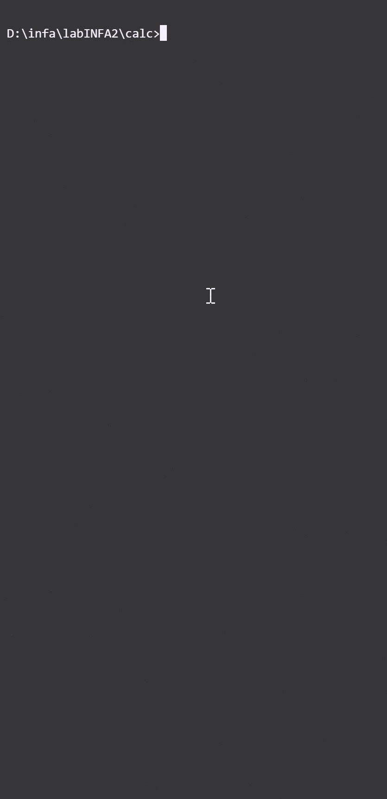
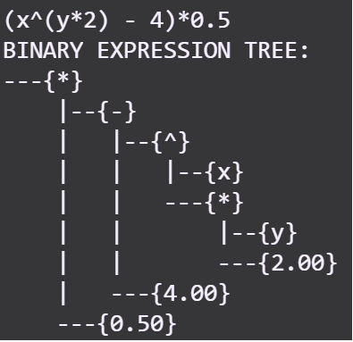

# Simple Interpreting Calculator Project

## Requirements
 - g++ compiler

## To build and run project:
```
make run
```

## Demo


## Algorithm
1. Get the expression as a string.
   - If string contains assignment operation then split it to variable and expression to evaluate. ('x=1+2' -> variable to assign a value to: 'x' and value to be assigned '1+2' (will be evaluated in next steps))
2. Convert string to array of special symbols (operators, operands, brackets, etc).
   1. Handle sequences of numbers to get numbers with multiple digits and number with floating point.
   2. Handle sequences of letters to get variables with multiple digits including numbers (like 'var1').
   3. Handle unary operators by converting them to binary operators (replace '-x' with '(-1)*x').
3. Convert array of special symbols to BET (binary expression tree) 
   - If current expression is length of 1, then add it to root.
   - Else find the last operator with the minimum priority and add it to root. Then add to root the result of recursive call of the same function on the expression on the left and right side of this operator.
4. Evaluate binary BET from bottom to top.
   - If the node is number or variable, then return it's value.
   - Else (the node is operator) return the result of recursive call of the same function on the right and left child.

## Main features
- Functions
- Types: floating point, integer, nan
- Basic binary operations: - + * /
- Binary shifts < and >
- Unary + and -
- Multiple digits numbers. ex: 123
- Multiple digits variables (including numbers on non-first position). ex: length1
- Floating point number. 3.14 or .15
- Positive integer powers: 2^3 -> 8
- Space ignoring in expressions for better user experience.
- Syntax errors handling
- External Libraries

## Other features

### See the result of previous evaluation with reserved underscore '_' variable
```
>>> 3*4 + 2^5
44
>>> _
44
>>> 
```

### Display current variables with their values with 'vars' command
```
>>> x=1
1
>>> y=2
2
>>> z=x*y^2
4
>>> vars
VARIABLES:
   _ = int   4
   x = int   1
   y = int   2
   z = int   4
END
```

## External libraries
Create .splc file with variable and function declarations.\
On runtime use 'import' keyword.\
Insude a library file you can only declare functions and assign values to variables. NOTHING MORE. Any other commands will be ignored.
```
>>> import math
importing: 'math'
import finished
```

## Functions
Define a function with keyword:
```
def:
```
Syntaxis of defining a function:
```
def: name([arg1, arg2, ...]) = expression
```
Example:
```
>>> def: mult_add_square(a,b,c)=a*b+c^2
new function 'mult_add_square' added
```
Maximum number of function args see in constants.h: FUNCTION_MAX_ARGS_N.\
Args can be:
- Number
- Variable
- Call of other function\
**Args can't be expression (like '3+1' or 'x*10').**
Example of calling a function defined in previous example with variable and number arg:
```
>>> x = 2
2
>>> mult_add_square(x,3,4) // 2*3 + 4^2 = 6 + 16 = 22
22
```
Example of calling a function with argument as another function call:
```
>>> def: f(x) = x^2
new function 'f' added
>>> def: g(x) = x+1
new function 'g' added
>>> g(f(2))
5
```
**Functions can use other functions in their expression:**
```
>>> def: f(x) = x^2
new function 'f' added
>>> def: g(y) = f(y)*2
new function 'g' added
>>> g(2)
8
```
To define a function with no args use null keyword
```
>>> def: f(null) = 10*0.5
new function 'f' added
>>> funcs
FUNCTIONS:
   f() = 10*0.5
END
```

### Save current variables in text or binary file. Load previously saved variables if binary file with them exists. Use keywords 'save', 'saveB', 'load'.
### Save and load example:
```
>>> x=1
1
>>> y=2
2
>>> saveB
successfully saved 3 variables
>>> x=0
0
>>> y=0
0
>>> load
successfully loaded 3 variables
>>> x
1
>>> y
2
```


### Close the application with 'exit'
```
>>> exit
bye
```
